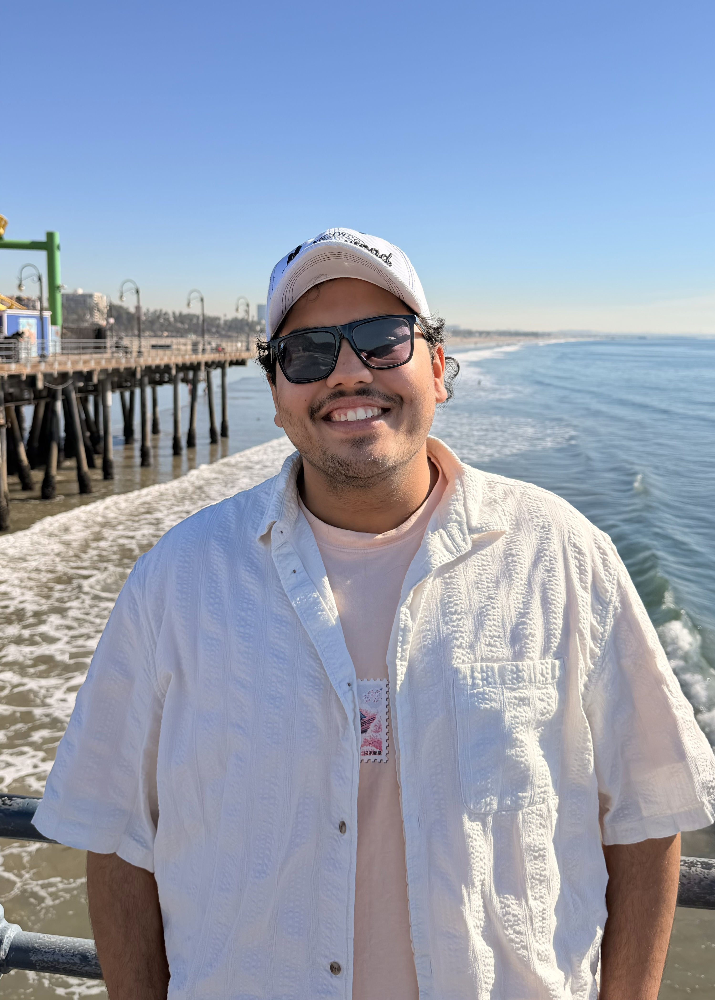

<div align="center">

# `JS.` — Jaimin Suthar

### Mechanical Engineer & Systems Integrator

**[ [Live Site](https://jaimin001607.github.io/Portfolio/) ]**

---



</div>

<br/>

## What is this?

A personal portfolio site built from scratch — no frameworks, no templates, no dependencies. Just raw **HTML + CSS + JS** on a cutting-mat-green background, because engineers build things on cutting mats.

<br/>

## Stack

```
HTML5          — semantic markup, zero frameworks
CSS3           — custom properties, grid, animations, responsive
JavaScript     — intersection observers, scroll effects, parallax
Fonts          — Bebas Neue · Space Mono · Outfit (Google Fonts)
Hosting        — GitHub Pages
```

<br/>

## Sections

| # | Section | What's there |
|---|---------|-------------|
| 01 | **About** | Bio, photo, stats, scrolling tools ticker |
| 02 | **Skills** | Mechanical Design, Analysis, Controls, Programming |
| 03 | **Experience** | Beach Aerial Division, Research Engineer, Beach Launch Team |
| 04 | **Education** | CSULB — BS Mechanical Engineering + Minor in CS |
| 05 | **Projects** | Autonomous Quadcopter, Brake Caliper, Thruster Ring, IMU Tracking, Rocket Avionics |
| 06 | **Contact** | Email, phone, LinkedIn, contact form |

<br/>

## Run locally

```bash
# clone it
git clone https://github.com/Jaimin001607/Portfolio.git
cd Portfolio

# serve it (any static server works)
python3 -m http.server 3000

# open http://localhost:3000
```

<br/>

## Design choices

- **Cutting mat background** — grid lines + diagonal crosshatch, inspired by actual engineering desk mats
- **Bebas Neue** for headings — bold, industrial, funky
- **Space Mono** for labels — monospace = engineer vibes
- **No build step** — open `index.html` and it just works
- **Fully responsive** — works on mobile, tablet, desktop

<br/>

<div align="center">

---

Built with precision & code by **Jaimin Suthar**

*CSULB '26 · Mechanical Engineering · Computer Science*

</div>
